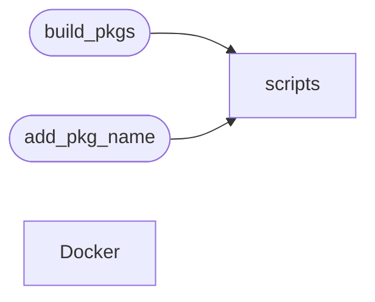

# Code Overview

[_Documentation generated by Documatic_](https://www.documatic.com)

<!---Documatic-section-Codebase Structure Python-start--->
## Codebase Structure Python

The codebase has a 3-deep folder structure,
                with 15 code files in total.

<!---Documatic-block-system_architecture-start--->

<!---Documatic-block-system_architecture-end--->

# #
<!---Documatic-section-Codebase Structure Python-end--->

<!---Documatic-section-Important Functions-start--->
## Important Functions

<!---Documatic-block-important_funcs-start--->
<!---Documatic-block-most_used_funcs-start--->
### Most Utilised Functions

* [f5-sdk-dist.scripts.terminal.terminal](3-f5-sdk-dist_scripts.md#f5-sdk-dist.scripts.terminal.terminal) (1 times)
* [f5-sdk-dist.scripts.configure.add_package](3-f5-sdk-dist_scripts.md#f5-sdk-dist.scripts.configure.add_package) (1 times)
<!---Documatic-block-most_used_funcs-end--->
<!---Documatic-block-important_funcs-end--->

# #
<!---Documatic-section-Important Functions-end--->

<!---Documatic-section-File IO-start--->
## File IO

<!---Documatic-block-file_io-start--->
The following files have file read operations

<!---Documatic-block-f5_sdk_dist-start--->

	
<code>f5_sdk_dist</code> (Click to Expand!)

* f5-sdk-dist.build_pkgs

<!---Documatic-block-f5_sdk_dist-end--->

<!---Documatic-block-f5_sdk_dist.Docker-start--->

	
<code>f5_sdk_dist.Docker</code> (Click to Expand!)

* f5-sdk-dist.Docker.redhat.7.build-rpm
* f5-sdk-dist.Docker.redhat.install_test.fetch_and_install_deps
* f5-sdk-dist.Docker.ubuntu.14.04.build-debs
* f5-sdk-dist.Docker.ubuntu.install_test.fetch_and_install_deps

<!---Documatic-block-f5_sdk_dist.Docker-end--->

<!---Documatic-block-f5_sdk_dist.scripts-start--->

	
<code>f5_sdk_dist.scripts</code> (Click to Expand!)

* f5-sdk-dist.scripts.configure
* f5-sdk-dist.scripts.construct_setups

<!---Documatic-block-f5_sdk_dist.scripts-end--->

The following files have file write operations

<!---Documatic-block-f5_sdk_dist.Docker-start--->

	
<code>f5_sdk_dist.Docker</code> (Click to Expand!)

* f5-sdk-dist.Docker.redhat.7.build-rpm: /root/.rpmmacros

<!---Documatic-block-f5_sdk_dist.Docker-end--->

<!---Documatic-block-f5_sdk_dist.scripts-start--->

	
<code>f5_sdk_dist.scripts</code> (Click to Expand!)

* f5-sdk-dist.scripts.configure
* f5-sdk-dist.scripts.construct_setups
* f5-sdk-dist.scripts.terminal

<!---Documatic-block-f5_sdk_dist.scripts-end--->
<!---Documatic-block-file_io-end--->

# #
<!---Documatic-section-File IO-end--->

<!---Documatic-section-Class Hierarchy-start--->
## Class Hierarchy

<!---Documatic-block-Exception-start--->

	
<code>Exception</code> (Click to Expand!)

* f5-sdk-dist.Docker.redhat.install_test.fetch_and_install_deps.InstallError
* f5-sdk-dist.scripts.build_exceptions.BuildError

<!---Documatic-block-Exception-end--->

<!---Documatic-block-f5_sdk_dist.Docker.redhat.install_test.fetch_and_install_deps.Dependency-start--->

	
<code>f5_sdk_dist.Docker.redhat.install_test.fetch_and_install_deps.Dependency</code> (Click to Expand!)

* f5-sdk-dist.Docker.redhat.install_test.fetch_and_install_deps.F5Dependency
* f5-sdk-dist.Docker.ubuntu.install_test.fetch_and_install_deps.F5Dependency

<!---Documatic-block-f5_sdk_dist.Docker.redhat.install_test.fetch_and_install_deps.Dependency-end--->

<!---Documatic-block-f5_sdk_dist.scripts.build_exceptions.BuildError-start--->

	
<code>f5_sdk_dist.scripts.build_exceptions.BuildError</code> (Click to Expand!)

* f5-sdk-dist.scripts.build_exceptions.DebianError
* f5-sdk-dist.scripts.build_exceptions.ErrorInTest
* f5-sdk-dist.scripts.build_exceptions.RedhatError

<!---Documatic-block-f5_sdk_dist.scripts.build_exceptions.BuildError-end--->

<!---Documatic-block-object-start--->

	
<code>object</code> (Click to Expand!)

* f5-sdk-dist.Docker.redhat.install_test.fetch_and_install_deps.Dependency
* f5-sdk-dist.scripts.build_expectations.Builds
* f5-sdk-dist.scripts.install_test.InstallTest
* [f5-sdk-dist.scripts.terminal.Hold](3-f5-sdk-dist_scripts.md#f5-sdk-dist.scripts.terminal.Hold)

<!---Documatic-block-object-end--->

# #
<!---Documatic-section-Class Hierarchy-end--->

[_Documentation generated by Documatic_](https://www.documatic.com)