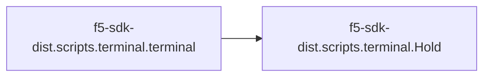
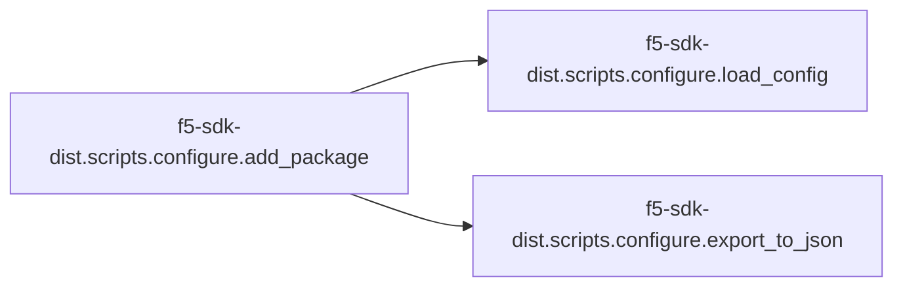

# F5-sdk-dist Scripts

[_Documentation generated by Documatic_](https://www.documatic.com)

<!---Documatic-section-Codebase Structure-start--->
## Codebase Structure

<!---Documatic-block-system_architecture-start--->
```mermaid
None
```
<!---Documatic-block-system_architecture-end--->

# #
<!---Documatic-section-Codebase Structure-end--->

<!---Documatic-section-f5_sdk_dist.scripts.terminal.terminal-start--->
## [f5-sdk-dist.scripts.terminal.terminal](3-f5-sdk-dist_scripts.md#f5-sdk-dist.scripts.terminal.terminal)

<!---Documatic-section-terminal-start--->


### Object Calls

* [f5-sdk-dist.scripts.terminal.Hold](3-f5-sdk-dist_scripts.md#f5-sdk-dist.scripts.terminal.Hold)

<!---Documatic-block-f5_sdk_dist.scripts.terminal.terminal-start--->
<details>
	<summary><code>f5_sdk_dist.scripts.terminal.terminal</code> code snippet</summary>

```python
def terminal(cmd, log=None, args=[], want_result=True, multi_stmt=False):
    Error = None
    succeeded = False
    if log and isinstance(log, str) and os.access(log, os.W_OK):
        fh = open(log, 'w')
    else:
        fh = Hold()
    if args and isinstance(cmd, str):
        cmd = [cmd]
        cmd.extend(args)
    try:
        proc = subprocess.Popen(cmd, shell=multi_stmt, stdout=subprocess.PIPE, stderr=subprocess.PIPE)
        (out, err) = proc.communicate()
        fh.write('Out:\n' + str(out))
        fh.write('Err:\n' + str(err))
        succeeded = True if proc.returncode == 0 else False
    except OSError as Error:
        fh.write(str(Error))
    except subprocess.CalledProcessError as Error:
        fh.write(str(Error))
    try:
        fh.close()
        result = Result(succeeded, None, Error)
    except Exception:
        if want_result:
            result = Result(succeeded, fh.get_held(), Error)
        elif not want_result:
            result = Result(succeeded, None, Error)
            fh.output()
    return result
```
</details>
<!---Documatic-block-f5_sdk_dist.scripts.terminal.terminal-end--->
<!---Documatic-section-terminal-end--->

# #
<!---Documatic-section-f5_sdk_dist.scripts.terminal.terminal-end--->

<!---Documatic-section-f5_sdk_dist.scripts.configure.add_package-start--->
## [f5-sdk-dist.scripts.configure.add_package](3-f5-sdk-dist_scripts.md#f5-sdk-dist.scripts.configure.add_package)

<!---Documatic-section-add_package-start--->


### Object Calls

* [f5-sdk-dist.scripts.configure.load_config](3-f5-sdk-dist_scripts.md#f5-sdk-dist.scripts.configure.load_config)
* [f5-sdk-dist.scripts.configure.export_to_json](3-f5-sdk-dist_scripts.md#f5-sdk-dist.scripts.configure.export_to_json)

<!---Documatic-block-f5_sdk_dist.scripts.configure.add_package-start--->
<details>
	<summary><code>f5_sdk_dist.scripts.configure.add_package</code> code snippet</summary>

```python
def add_package(pkg_type, pkg_name, working=None):
    kvp = {pkg_type: pkg_name}
    working = os.getcwd() if not working else os.path.abspath(working)
    if '-dist/scripts' in working:
        config = working + '/config.JSON'
    elif '-dist' in working:
        config = working + '/scripts/config.JSON'
    else:
        config = working + '/*-dist/scripts/config.JSON'
        entropy = glob.glob(config)
        if entropy:
            config = entropy[0]
    print('config', config, 'working', working)
    config = load_config(config)
    config.update(kvp)
    export_to_json(config)
```
</details>
<!---Documatic-block-f5_sdk_dist.scripts.configure.add_package-end--->
<!---Documatic-section-add_package-end--->

# #
<!---Documatic-section-f5_sdk_dist.scripts.configure.add_package-end--->

<!---Documatic-section-f5_sdk_dist.scripts.configure.export_to_json-start--->
## [f5-sdk-dist.scripts.configure.export_to_json](3-f5-sdk-dist_scripts.md#f5-sdk-dist.scripts.configure.export_to_json)

<!---Documatic-section-export_to_json-start--->
<!---Documatic-block-f5_sdk_dist.scripts.configure.export_to_json-start--->
<details>
	<summary><code>f5_sdk_dist.scripts.configure.export_to_json</code> code snippet</summary>

```python
def export_to_json(env):
    json_fl = env['scripts'] + '/config.JSON'
    with open(json_fl, 'w') as fh:
        fh.write(json.dumps(env, sort_keys=True, indent=4, separators=(',', ': ')))
```
</details>
<!---Documatic-block-f5_sdk_dist.scripts.configure.export_to_json-end--->
<!---Documatic-section-export_to_json-end--->

# #
<!---Documatic-section-f5_sdk_dist.scripts.configure.export_to_json-end--->

<!---Documatic-section-f5_sdk_dist.scripts.terminal.Hold-start--->
## [f5-sdk-dist.scripts.terminal.Hold](3-f5-sdk-dist_scripts.md#f5-sdk-dist.scripts.terminal.Hold)

<!---Documatic-section-Hold-start--->
<!---Documatic-block-f5_sdk_dist.scripts.terminal.Hold-start--->
<details>
	<summary><code>f5_sdk_dist.scripts.terminal.Hold</code> code snippet</summary>

```python
class Hold(object):

    def __init__(self):
        self.held = str()

    def __str__(self):
        return self.get_held()

    def __enter__(self):
        return self

    def __exit__(self):
        self.held = ''

    def writeline(self, addition):
        """writeline()

Functions like a file.writeline() call; however, it stores into the object's
cached memory rather than a file's IO.
        """
        addition = addition.strip()
        self.held = self.held + addition + '\n'

    def write(self, addition):
        """write()

Functions like a file.write() call; however, it stores into the object's cached
memory rather than a file's IO.
        """
        self.held = self.held + addition

    def output(self):
        """output()

Dumps the contents of the cache as a string into the terminal.
        """
        print(self.held)

    def get_held(self):
        """get_held()

Returns the cached contents as a str() object.
        """
        return self.held
```
</details>
<!---Documatic-block-f5_sdk_dist.scripts.terminal.Hold-end--->
<!---Documatic-section-Hold-end--->

# #
<!---Documatic-section-f5_sdk_dist.scripts.terminal.Hold-end--->

<!---Documatic-section-f5_sdk_dist.scripts.configure.load_config-start--->
## [f5-sdk-dist.scripts.configure.load_config](3-f5-sdk-dist_scripts.md#f5-sdk-dist.scripts.configure.load_config)

<!---Documatic-section-load_config-start--->
<!---Documatic-block-f5_sdk_dist.scripts.configure.load_config-start--->
<details>
	<summary><code>f5_sdk_dist.scripts.configure.load_config</code> code snippet</summary>

```python
def load_config(filename):
    config = None
    if os.path.isfile(filename) and os.access(filename, os.R_OK):
        with open(filename, 'r') as fh:
            config = json.loads(fh.read())
    return config
```
</details>
<!---Documatic-block-f5_sdk_dist.scripts.configure.load_config-end--->
<!---Documatic-section-load_config-end--->

# #
<!---Documatic-section-f5_sdk_dist.scripts.configure.load_config-end--->

[_Documentation generated by Documatic_](https://www.documatic.com)